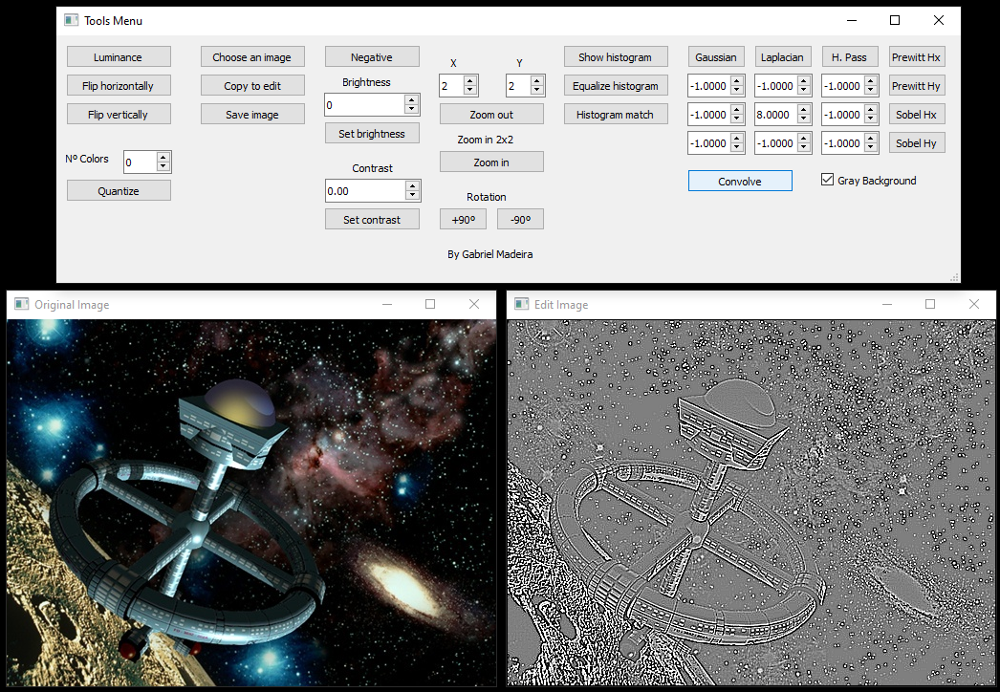

# image-processing-app

The goal of this project was to build an application for image manipulation (like Adobe Photoshop) but implement the image operations instead of using some method of existent libraries.

There are available operations like 3x3 convolution, quantization, brightness, contrast, rotation, flip, zoom in/out and negative.

This application was developed for Fundamentals of Digital Image Processing course (INF01046) at UFRGS.

## Dependencies

- Qt
- OpenCV